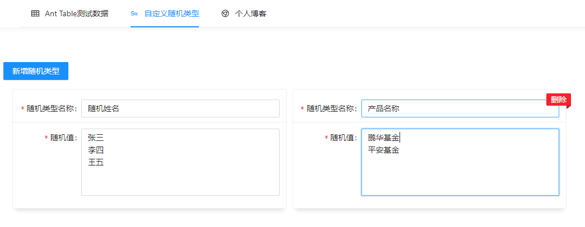

项目基于 React + ant design4.x  开发的小工具。

1. 平时开发项目中经常用到 ant design 的 `Table 组件`, `Table组件`里面 column 配置每次都要复制然后手动修改, 极其麻烦; 另外在没有进行接口联调的时候页面没数据; 因此开发出可视化界面, 用来生成配置(column) 和 数据源(dataSource);

   

2. 自义定随机的数据

   根据自己需求提供随机值，然后保存，即可在Ant Table随机值类型里面看到自己定义的随机类型。

   

   

访问地址：

- https://cjperfect.gitee.io/ 或者 https://cxkyyds.xyz/ （走的是 github，国内访问较慢）
