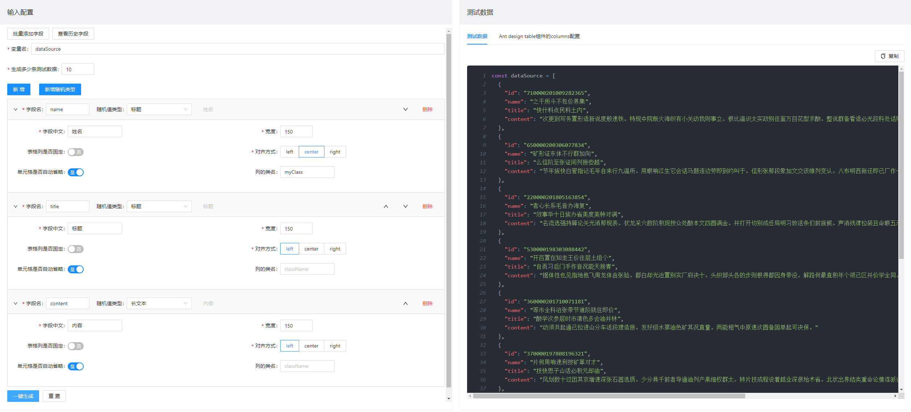
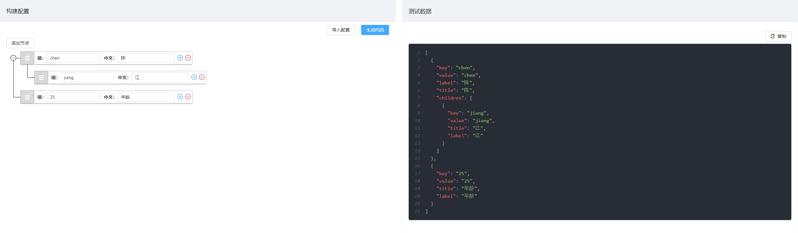

项目基于 React + ant design4.x + typescript + redux-toolkit 实现的。

1. 平时开发项目中经常用到 ant design 的 `Table 组件`和`Select 组件`, `Table组件`里面 column 配置每次都要复制然后手动修改, 极其麻烦; 另外在没有进行接口联调的时候页面没数据; 因此开发出可视化界面, 用来生成配置(column) 和 数据源(dataSource);

   

2. `Select组件`的下拉框需要一些测试数据, 通过可视化界面生成测试数据; 另外拖拽改变层级, 数据可用于`Tree组件`。

   

访问地址：

- https://cjperfect.gitee.io/ 或者 https://cxkyyds.xyz/ （走的是 github，国内访问较慢）
